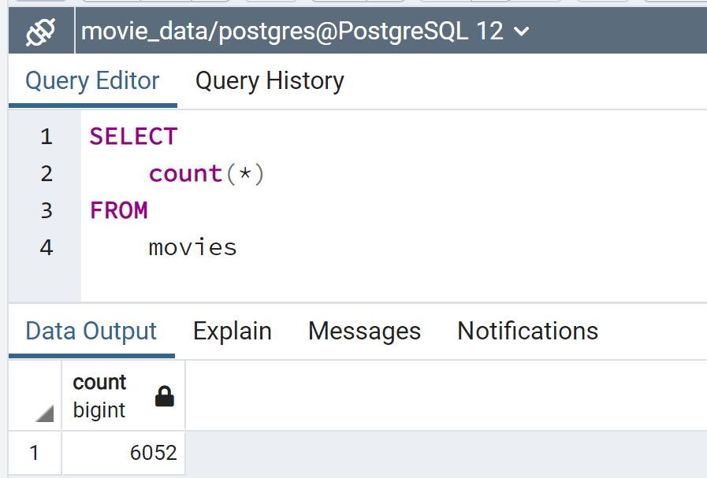
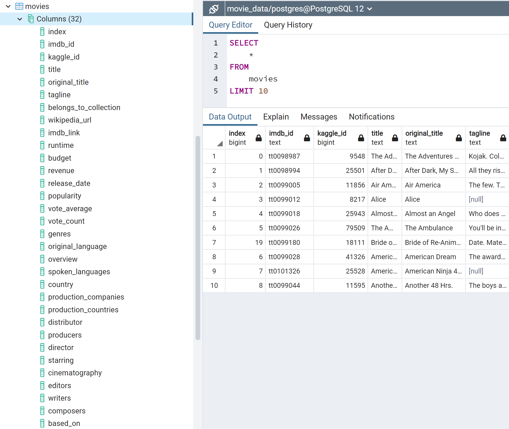
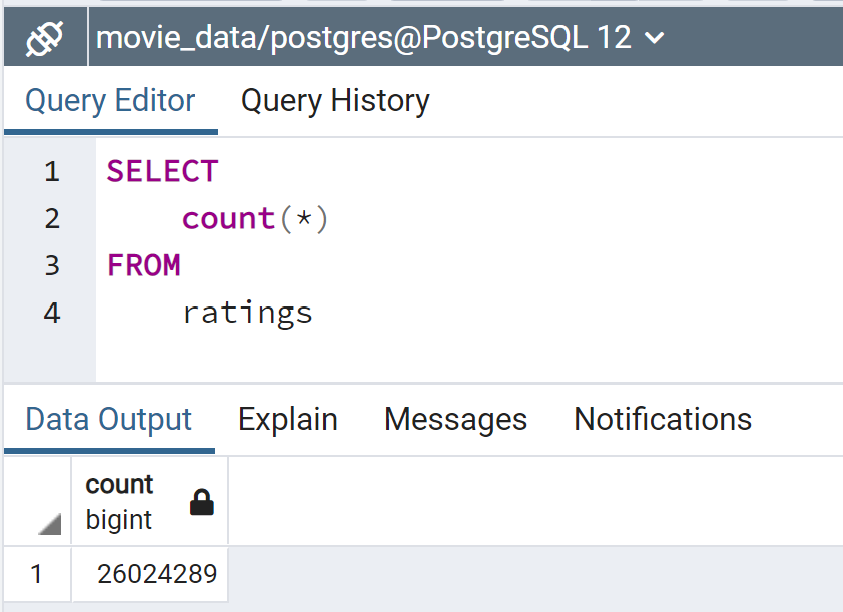
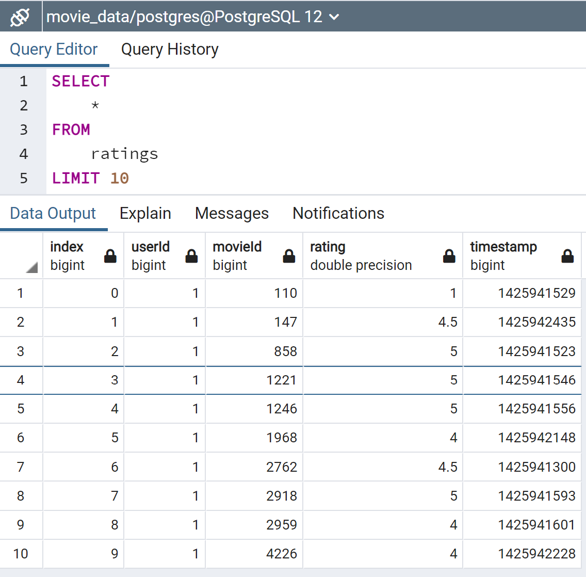

# Movies-ETL

## Objective

Prepare a dataset (SQL database) that will be used in a hackaton with the objective of predict popular pictures.

- Two data sources:
  - Wikipedia: scrape of all movies released since 1990
  - Movie Land's rating data
  
The proccess will to extract, transform / clean, consolidate in one data set, and load into a SQL table.

## Tools

- Jupyter Notebook
- Python Modules
  - time
  - json
  - pandas
  - numpy
  - os
  - re
  - sqlalchemy

## Process Highlight

- Filter json usinf list comprehensions
- Define functions to consolidate and clean data
- Remove doplicates from dataframes
- Use of lambda functions
- Parse information using Regex
- Merge Dataframes
- Use of plots to define cleaning strategy
- send information from pandas dataframes to SQL

## Results

### Movies table

### Ratings table

